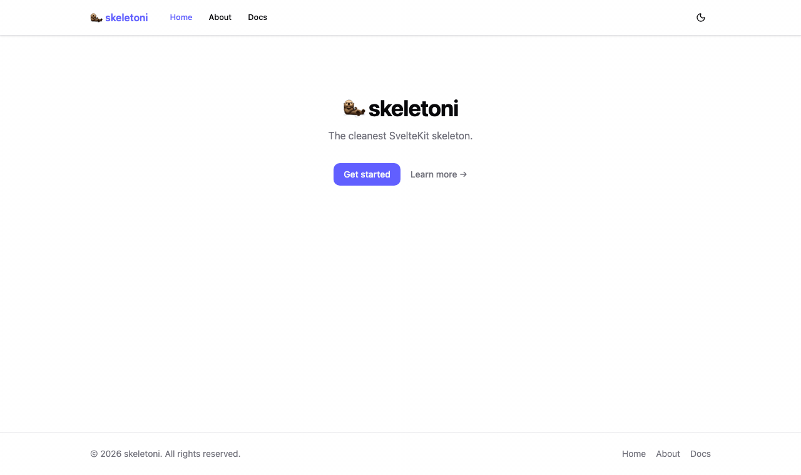

# skeletoni



The cleanest possible SvelteKit 5 starter — opinionated, minimal, production-ready.
Every dependency earns its place. Nothing speculative.

---

## Stack

| Responsibility | Tool | Notes |
|---|---|---|
| Framework | [SvelteKit 5](https://svelte.dev/docs/kit) | File-based routing, SSR, `+page`, `+layout`, `+server` |
| Language | [TypeScript (strict)](https://www.typescriptlang.org/) | Zero runtime cost; `any` is banned |
| Styling | [Tailwind CSS v4](https://tailwindcss.com/) | Utility-first; design tokens via OKLCH CSS vars |
| Components | [shadcn-svelte](https://www.shadcn-svelte.com/) | Copy-owned components; no runtime dependency bloat |
| Component primitives | [bits-ui](https://bits-ui.com/) | Headless, accessible primitives backing shadcn-svelte |
| Icons | [lucide-svelte](https://lucide.dev/) | Svelte 5-native icon components |
| Linting | [ESLint](https://eslint.org/) + [eslint-plugin-svelte](https://sveltejs.github.io/eslint-plugin-svelte/) | Svelte-aware lint rules |
| Formatting | [Prettier](https://prettier.io/) + [prettier-plugin-svelte](https://github.com/sveltejs/prettier-plugin-svelte) | Consistent code style across `.svelte`, `.ts`, `.css` |
| Type checking | [svelte-check](https://github.com/sveltejs/language-tools/tree/master/packages/svelte-check) | SvelteKit-aware TypeScript checking |
| Unit tests | [Vitest](https://vitest.dev/) | Vite-native, fast, ESM-first |
| E2E tests | [Playwright](https://playwright.dev/) | Functional + visual screenshot comparison |
| Bundler | [Vite](https://vite.dev/) | Dev server with HMR, optimised production build |
| Server adapter | [@sveltejs/adapter-node](https://svelte.dev/docs/kit/adapter-node) | Standalone Node.js server — Docker-friendly |
| Containerisation | [Docker](https://www.docker.com/) | Multi-stage build, non-root user, Node 22 |
| Releases | [semantic-release](https://semantic-release.gitbook.io/semantic-release/) | Automated versioning from Conventional Commits |
| Dependency updates | [Renovate](https://docs.renovatebot.com/) | Automated PRs to keep deps fresh |

---

## Use as Template

Click **"Use this template"** on GitHub, or:

```bash
gh repo create my-app --template lkshrk/skeletoni --public --clone
cd my-app
bash scripts/setup.sh
pnpm install
pnpm dev
```

The setup script prompts for project name, display name, emoji, and description — then replaces all template placeholders across the codebase and self-deletes.

---

## Setup

### Prerequisites

- **Node.js ≥ 22.12.0** — required for `--experimental-strip-types` (TypeScript scripts run without a transpile step)
- **pnpm** — `npm install -g pnpm`
- **ffmpeg** _(optional)_ — only needed to regenerate `demo/preview.gif`

### 1. Clone

```bash
git clone https://github.com/YOUR_USER/skeletoni.git my-app
cd my-app
```

### 2. Install dependencies

```bash
pnpm install
```

### 3. Configure environment

```bash
cp .env.example .env
```

Edit `.env`:

```bash
# Full URL of the site — no trailing slash
PUBLIC_BASE_URL=http://localhost:5173

# Appears in browser tab titles: "Page | My App"
PUBLIC_SITE_NAME=My App
```

### 4. Start dev server

```bash
pnpm dev
```

Open [http://localhost:5173](http://localhost:5173).

### 5. Check, lint, and test

```bash
pnpm check          # TypeScript + Svelte type checking
pnpm lint           # ESLint
pnpm test           # Vitest unit tests
pnpm test:e2e       # Playwright E2E (functional + visual)
```

Visual snapshot tests write baseline PNGs to `tests/e2e/__snapshots__/` on first run.
Commit the snapshots — CI compares against them on every push.

### 6. Production build

```bash
pnpm build          # Outputs to build/
pnpm preview        # Serve build/ locally at :4173
```

### 7. Docker

```bash
docker build -t skeletoni .
docker run -p 3000:3000 --env-file .env skeletoni
```

---

## Key Conventions

### Adding a route

1. Create `src/routes/my-route/+page.svelte`.
2. Override the default `<title>` and `<meta name="description">` by adding a server load function:

   ```ts
   // src/routes/my-route/+page.server.ts
   export function load() {
     return {
       meta: { title: 'My Route', description: 'What this page is about.' },
     };
   }
   ```

3. Add the link to `src/lib/components/Navbar.svelte` (the `navLinks` array near the top).

### Defining brand colours

All design tokens live in `src/app.css`. To change the brand colour:

```css
:root {
  --brand: oklch(0.585 0.233 277); /* light-mode value — indigo by default */
  --brand-foreground: oklch(0.985 0 0);
}

.dark {
  --brand: oklch(0.673 0.201 276); /* dark-mode value — slightly lighter */
  --brand-foreground: oklch(0.985 0 0);
}
```

Use the token in components via Tailwind utilities: `bg-brand`, `text-brand`, `border-brand`, `hover:bg-brand/90`, etc.

### Commit messages

This project uses [Conventional Commits](https://www.conventionalcommits.org/):

| Prefix | When to use |
|---|---|
| `feat:` | New user-visible feature |
| `fix:` | Bug fix |
| `refactor:` | Code change with no user-visible effect |
| `perf:` | Performance improvement |
| `test:` | Adding or updating tests |
| `chore:` | Tooling, config, deps |
| `docs:` | Documentation only |
| `ci:` | CI/CD pipeline |

`semantic-release` reads these prefixes to determine the version bump (`feat` → minor, `fix` → patch) and generate `CHANGELOG.md` automatically on every merge to `main`.

### Regenerating the preview GIF

```bash
pnpm preview:gif
```

Requires `ffmpeg` (`brew install ffmpeg`).
The script builds the app, starts the preview server, captures every route in light and dark mode, and writes `demo/preview.gif`.
Captured frames are written to `demo/frames/` (gitignored — only the final GIF is committed).
